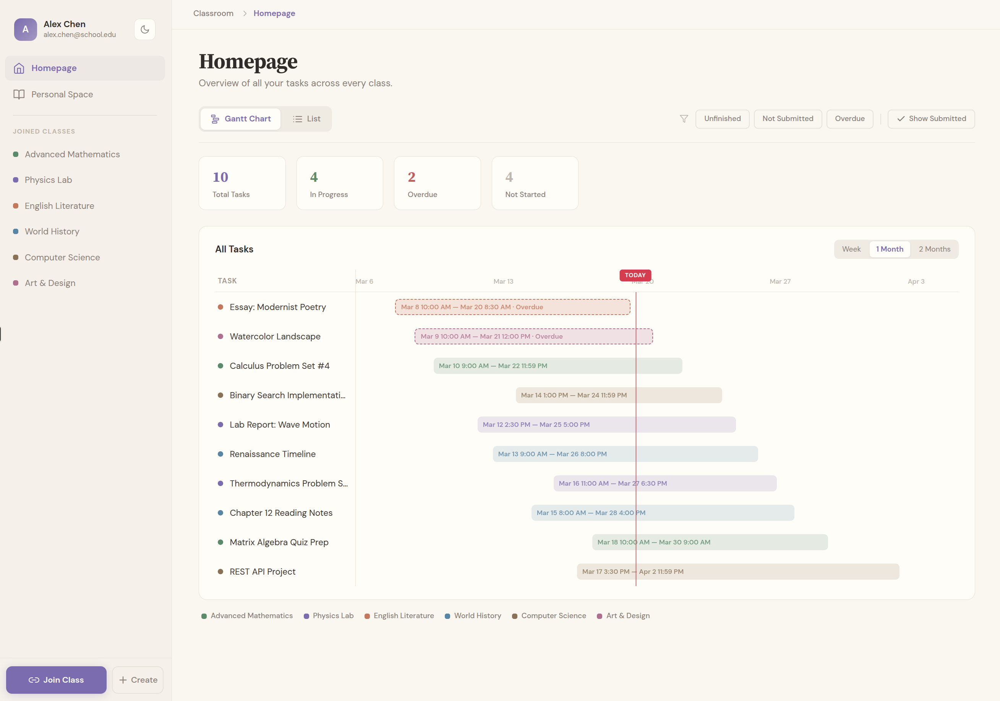

# TaskNeo

> **💡 提示：**
> 本项目作为毕业设计提供。本人和本项目代码同为图一乐水平，**将本系统应用于生产环境或商业用途前请自行进行安全评估**。感谢理解与交流！
>
> **📄 许可证：**
> 本项目采用 [MIT License](LICENSE) 协议开源。


班级教学任务管理系统。教师创建班级、发布任务、收集作业、批量评分导出；学生通过邀请码加入班级、查看任务、提交作业。系统借助大语言模型将自然语言描述自动解析为结构化任务信息。提供MCP工具供 Agent 程序调用。

[DEMO](https://app.taskneo.space) 在线体验

同类产品过多，本项目不再继续更新，演示环境和基础维护会在2027年1月31日结束，届时演示环境的用户数据会被删除。

---



## 功能概览

- **班级管理**：创建班级、邀请码加入、成员角色管理（所有者 / 管理员 / 成员）
- **任务管理**：Markdown 正文、附件、前置任务关联、甘特图视图
- **多语言与时区支持**：国际化界面和内容，根据用户偏好显示截止时间
- **AI 解析**：粘贴自然语言，自动提取任务名称、起止时间等字段，生成正文描述
- **作业收集**：成员提交文件、管理员查看提交详情、批量重命名下载、一键导出 CSV 成绩单
- **MCP 支持**: 可使用OpenClaw、Hermes等Agent与本系统联动，构建您自己的工作流完成任务管理和作业批改
- **通知系统**：任务发布和截止前通过电子邮件异步推送
- **个人空间**：注册后自动创建私人班级，用于个人任务管理
- **管理控制台**：`/admin` 配置 SMTP、LLM API、注册开关、学校列表、审计

---

## 技术栈

| 层 | 技术 |
|---|---|
| 前端 | Next.js 16 App Router · TypeScript · Tailwind CSS · shadcn/ui |
| 数据获取 | SSR 服务端预取（React `cache`）· SWR 客户端缓存 |
| 后端 | Hono · Node.js · TypeScript |
| 数据库 | PostgreSQL 16 · Prisma 6 ORM |
| 文件存储 | S3 兼容的对象储存 |
| 任务队列 | BullMQ · Redis |
| 包管理 | pnpm workspaces（monorepo） |

---


## 本地开发

### 前置要求

- Node.js 22
- pnpm
- Docker（用于运行 PostgreSQL、Redis、MinIO）

### 启动步骤

```bash
# 1. 克隆仓库
git clone <repo-url> && cd taskflow

# 2. 复制并填写环境变量
cp .env.example .env

# 3. 安装依赖
pnpm install

# 4. 执行数据库迁移
cd packages/db && npx prisma migrate dev && cd ../..

# 5. 一键启动本地开发环境
pnpm dev

# 6. （可选）注入本地演示数据
pnpm dev:seed
```

如需在 `pnpm dev:seed` 时同时自动填充 Admin 的 LLM 基础配置，可在本地 `.env` 设置：

```bash
DEV_SEED_LLM_PROVIDER=openai
DEV_SEED_LLM_BASE_URL=https://api.openai.com/v1
DEV_SEED_LLM_MODEL=gpt-4o-mini
DEV_SEED_LLM_API_KEY=<your_key>
```

该 API Key 会按 `SYSTEM_CONFIG_SECRET` 加密后写入 `system_config`。

### 认证与会话模型

- 普通用户登录态使用服务端持久化的 opaque session token，格式为 `tfses_<random>`。
- `Authorization` 仍使用 Bearer 头，但 Bearer 值不是 JWT；会话真源在数据库 `sessions` 表。
- `/auth/logout`、`/users/me/sessions`、`/users/me/sessions/:id` 都会直接撤销服务端 session，失效立即生效。
- `trustDevice=true` 时创建 30 天滑动续期的浏览器会话；未勾选时是 7 天固定过期。
- MCP 认证链路是 `MCP key -> /auth/mcp -> MCP session token`。撤销 MCP key 会切断关联 MCP sessions。
- Redis 只用于 BullMQ 队列和业务缓存，不再承担用户认证缓存或 token 黑名单职责。

默认访问：

- 前端：http://localhost:3000
- 管理后台：http://localhost:3000/admin
- 后端 API：http://localhost:3001
- MinIO 控制台：http://localhost:9001（用户名/密码见 `.env`）

更多命令见：[`docs/deployment/local-dev.md`](docs/deployment/local-dev.md)

可选的分步命令：

```bash
pnpm dev:infra
pnpm dev:api
pnpm dev:web
pnpm dev:seed
pnpm dev:down
```

如需在 `pnpm dev` 启动时自动注入演示数据，可使用：

```bash
TASKFLOW_DEV_SEED=true pnpm dev
```

### 环境变量说明

复制 `.env.example` 后，必填项：

| 变量 | 说明 |
|---|---|
| `ADMIN_TOKEN` | 管理员控制台访问令牌，只负责 `/admin` 鉴权 |
| `SYSTEM_CONFIG_SECRET` | 敏感系统配置的数据库加密密钥，需保持稳定 |
| `AUDIT_LOG_HMAC_SECRET` | 审计日志 HMAC 链密钥，生产环境建议与 `SYSTEM_CONFIG_SECRET` 分离 |
| `DATABASE_URL` | PostgreSQL 连接串 |
| `NEXT_PUBLIC_API_BASE_URL` | 前端访问后端 API 的地址，开发环境默认 `http://localhost:3001` |

其余业务配置（SMTP 主机、端口、发件人、LLM 模型等）在启动后通过 `/admin` 控制台填写；其中敏感值会使用 `SYSTEM_CONFIG_SECRET` 加密后存入数据库。

---

## 生产部署

详见 [`docs/deployment/production.md`](docs/deployment/production.md)。

支持两种部署架构，按需选择：

**单机部署（推荐默认）**：Web + API + PostgreSQL + Redis 全部以 Docker 运行在同一台 VPS 上。Next.js SSR 预取走容器内网，延迟极低，运维简单，适合大多数场景。

**分离部署（高并发场景）**：Web 部署到 Vercel 自动扩容，VPS 只跑 API + Redis + Worker，数据库使用托管 PostgreSQL（如 Neon）。SSR 预取需跨公网访问 API，**须将 Vercel Function 区域固定到与 VPS 同地区**，否则延迟会抵消 SSR 的性能收益。文件储存使用第三方 S3 兼容服务（推荐 Cloudflare R2）。

---

## 分支策略

| 分支 | 用途 |
|------|------|
| `main` | 生产发布，受保护 |
| `dev` | 日常集成分支 |
| `feat/*`, `fix/*` | 功能/修复分支，完成后 PR 合并到 `dev` |

发布流程：`dev` 稳定后提 PR 合并到 `main`。

---

## FOR AI AGENT

开始工作前请阅读：

1. `AGENT.md` — 项目结构、技术栈、关键约定
2. `docs/DATABASE.md` — 涉及数据库操作时必读
3. `docs/openapi/openapi.yaml` — 实现或调用接口时必读
4. `docs/features/<功能名>.md` — 实现具体功能时按需阅读
