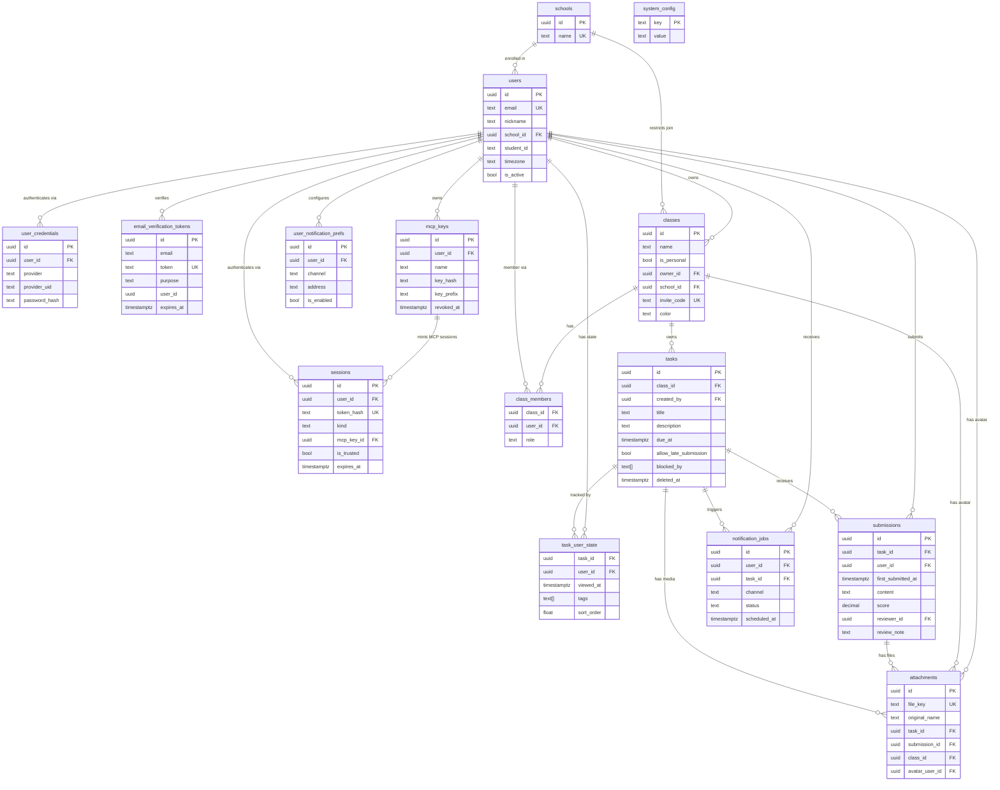

# TaskFlow — Database Design

> Authoritative source of truth for data structure and design decisions.  
> The actual schema implementation lives in `packages/db/prisma/schema.prisma`.  
> This document explains the *why* behind every decision.

---

## Design Principles

- **Primary keys**: UUID v4 everywhere via Prisma `@default(uuid())`.
- **Timestamps**: `createdAt` on all tables. `updatedAt` on all mutable tables. All stored as `timestamptz` (UTC). Frontend converts to user local timezone using `Intl.DateTimeFormat`.
- **Hard delete by default.** The only exception is `tasks`, which uses soft delete via `deletedAt` to preserve submission FK integrity.
- **Tasks belong to exactly one class.** No multi-class publishing.
- **No dynamic field schemas.** Grading fields are fixed columns on `submissions`.
- **Credentials are separated from identity** to support future OAuth providers without schema migration.
- **Admin is not a database entity.** `/admin` routes are authenticated by `ADMIN_TOKEN` env var only.
- **Sensitive system config is encrypted at rest.** Secret values in `system_config` use `SYSTEM_CONFIG_SECRET`, which is intentionally separate from `ADMIN_TOKEN`.
- **Application layer enforces business rules** that cannot be expressed as database constraints in Prisma (conditional uniqueness, cross-field validation). These are noted per table below.

### Runtime Secrets

The backend currently relies on two runtime secrets with different responsibilities:

- `ADMIN_TOKEN`: authenticates `/admin` requests only.
- `SYSTEM_CONFIG_SECRET`: encrypts and decrypts sensitive `system_config` entries such as SMTP and LLM credentials.

These secrets should not be reused for each other. In particular, rotating `ADMIN_TOKEN` must not invalidate encrypted config rows.
Rotating `SYSTEM_CONFIG_SECRET` does invalidate previously encrypted `system_config` secrets until those values are re-entered and saved again.

---

## Tables

### schools

Controlled list of institutions. Managed by system admin via `/admin`.

| Column | Type | Notes |
|---|---|---|
| id | UUID PK | |
| name | String UNIQUE | |
| createdAt | DateTime | timestamptz |

No `updatedAt` — names are treated as immutable. Delete and recreate if a name must change.

---

### users

Core identity record. Does not contain credentials or notification preferences.

| Column | Type | Notes |
|---|---|---|
| id | UUID PK | |
| email | String UNIQUE | login identifier |
| nickname | String? | NULL is rendered as email in UI |
| schoolId | UUID? FK → schools | SET NULL on school delete |
| studentId | String? | unique within school (see below) |
| timezone | String | IANA timezone identifier, default `'UTC'`, max 64 chars |
| isActive | Boolean | default true; false = suspended by admin |
| createdAt | DateTime | |
| updatedAt | DateTime | |

**Constraints**:
- `@@unique([schoolId, studentId])` — student number is unique within a school.
- Rule "studentId requires schoolId" is enforced in the application layer (registration and profile update services), not in the database.

**Deletion precondition** (application layer):
1. User must not own any non-personal class. The UI guides the user to transfer or disband first.
2. Once precondition is met: DELETE submissions → DELETE personal class (cascades to its tasks and attachments) → DELETE user row. Zero residue.

---

### user_credentials

Authentication methods, separated from identity to support multiple providers per user.

| Column | Type | Notes |
|---|---|---|
| id | UUID PK | |
| userId | UUID FK → users | CASCADE on delete |
| provider | Enum AuthProvider | `LOCAL` \| `GOOGLE` \| `GITHUB` |
| providerUid | String? | OAuth subject ID; null for LOCAL |
| passwordHash | String? | bcrypt hash; null for OAuth |
| createdAt | DateTime | |
| updatedAt | DateTime | |

**Constraints**:
- `@@unique([provider, providerUid])` — one identity per provider.
- `@@unique([userId, provider])` — one credential per provider per user.
- Rule "LOCAL must have passwordHash; OAuth must have providerUid" is enforced in the service layer.

**v1**: Only `LOCAL` provider is implemented. `GOOGLE` and `GITHUB` enum values are reserved.

---

### email_verification_tokens

Short-lived single-use tokens for registration, password reset, and email change flows.

| Column | Type | Notes |
|---|---|---|
| id | UUID PK | |
| email | String | target email address |
| token | String UNIQUE | opaque random token sent in email links |
| purpose | Enum EmailTokenPurpose | `REGISTRATION` \| `PASSWORD_RESET` \| `EMAIL_CHANGE` |
| userId | UUID? | present for password reset and email change |
| expiresAt | DateTime | 1 hour TTL |
| createdAt | DateTime | |

**Operational rules**:
- Tokens are single-use and deleted after successful consumption.
- Rate limiting is enforced in the application layer by counting rows per `(email, purpose)` over the trailing 24 hours.
- These tokens live in PostgreSQL, not Redis, so email flows continue to match the server-side source of truth model.

---

### mcp_keys

Long-lived credentials that let external AI tools mint MCP sessions on behalf of a user.

| Column | Type | Notes |
|---|---|---|
| id | UUID PK | |
| userId | UUID FK → users | CASCADE on delete |
| name | String | user-facing label, e.g. `Claude Desktop` |
| keyHash | String | SHA-256 of the raw key; raw key is never stored |
| keyPrefix | String | short prefix shown in UI for identification |
| lastUsedAt | DateTime? | updated when `/auth/mcp` exchanges the key |
| expiresAt | DateTime? | null = no expiry |
| createdAt | DateTime | |
| revokedAt | DateTime? | null = active |

**Operational rules**:
- Raw keys are shown once at creation time, then discarded.
- Revoking a key must immediately revoke all `sessions.kind = MCP` rows tied to that key.
- Password changes, password resets, and “sign out other browser sessions” do **not** revoke MCP keys.

---

### sessions

Server-side authentication state for both browsers and MCP clients.

| Column | Type | Notes |
|---|---|---|
| id | UUID PK | |
| userId | UUID FK → users | CASCADE on delete |
| tokenHash | String UNIQUE | SHA-256 of opaque token `tfses_<random>` |
| kind | Enum SessionKind | `BROWSER` \| `MCP` |
| mcpKeyId | UUID? FK → mcp_keys | set only for MCP sessions |
| isTrusted | Boolean | true only for trusted browser sessions |
| userAgent | String? | up to 512 chars |
| ipAddress | String? | up to 45 chars |
| createdAt | DateTime | |
| lastSeenAt | DateTime | touched with 1 hour debounce for browser sessions |
| expiresAt | DateTime? | null allowed only for MCP sessions tied to non-expiring keys |

**Operational rules**:
- The database is the source of truth for session validity; no Redis auth cache sits in front of it.
- Untrusted browser sessions expire after 7 days and do not slide.
- Trusted browser sessions expire after 30 days and slide forward on touch.
- MCP sessions inherit the underlying key expiry and are not touched on each request.
- `POST /auth/logout` deletes the current session row.
- `DELETE /users/me/sessions` deletes only other browser sessions.
- `DELETE /users/me/sessions/{id}` can revoke either a browser session or an MCP session owned by the caller.

---

### user_notification_prefs

Per-user notification channel configuration. One row per user per channel.

| Column | Type | Notes |
|---|---|---|
| id | UUID PK | |
| userId | UUID FK → users | CASCADE on delete |
| channel | Enum NotifChannel | `EMAIL` \| `WEBHOOK` \| `TELEGRAM` |
| address | String | email address / webhook URL / Telegram chat ID |
| isEnabled | Boolean | default true |
| createdAt | DateTime | |
| updatedAt | DateTime | |

**Constraints**: `@@unique([userId, channel])` — one config per channel per user.

**v1**: Only `EMAIL` channel is active. The notification worker ignores `WEBHOOK` and `TELEGRAM` rows until those channels are implemented.

---

### classes

Organisational unit that owns tasks and members.

| Column | Type | Notes |
|---|---|---|
| id | UUID PK | |
| name | String | |
| description | String? | |
| color | String | hex color, default `#6366f1`, used for UI label badges |
| isPersonal | Boolean | default false; true = auto-created private space on registration |
| ownerId | UUID FK → users | **no cascade** — user must handle all classes before account deletion |
| schoolId | UUID? FK → schools | SET NULL on school delete; restricts who may join |
| inviteCode | String? UNIQUE | NULL for personal classes |
| createdAt | DateTime | |
| updatedAt | DateTime | |

**Ownership transfer**: UPDATE `ownerId` + UPDATE `class_members` role in a single transaction.

**School restriction**: checked at join time only. Existing members are unaffected if `schoolId` is changed after they joined.

---

### class_members

Membership and role within a class.

| Column | Type | Notes |
|---|---|---|
| classId | UUID FK → classes | CASCADE on delete |
| userId | UUID FK → users | CASCADE on delete |
| role | Enum ClassRole | `OWNER` \| `ADMIN` \| `MEMBER` |
| joinedAt | DateTime | |

**PK**: composite `[classId, userId]`.

**Invariant**: The class owner always has a row here with `role = OWNER`. This is maintained by the application layer on class creation and ownership transfer. It means "get all members including owner" requires only a single table query with no joins to `classes`.

---

### tasks

Usually belongs to one class. For class-deletion cleanup, a soft-deleted task can be detached from class (`classId = NULL`) while submissions still reference it.

| Column | Type | Notes |
|---|---|---|
| id | UUID PK | |
| classId | UUID? FK → classes | SET NULL on class delete; nullable for detached soft-deleted tasks |
| createdBy | UUID? FK → users | SET NULL on user delete |
| title | String | cleared to empty string on soft delete |
| description | String? | Markdown source; cleared to NULL on soft delete |
| startAt | DateTime? | timestamptz |
| dueAt | DateTime? | timestamptz |
| allowLateSubmission | Boolean | default true; see semantics below |
| blockedBy | String[] | array of task UUIDs; no FK enforcement; frontend renders dependency lines |
| deletedAt | DateTime? | NULL = active; non-NULL = soft deleted |
| createdAt | DateTime | |
| updatedAt | DateTime | |

**Soft delete behaviour**:
- `deletedAt IS NULL` → active, visible to all class members.
- `deletedAt IS NOT NULL` → deleted. `title` is set to `""`, `description` to NULL, and all task attachments are deleted from MinIO and the DB. The row is preserved only to keep `submissions.taskId` FK valid.
- If a task has **zero submissions** at deletion time → hard delete. Full CASCADE cleanup, no row preserved.

**`allowLateSubmission` semantics** (enforced in service layer):
- `true` → no restrictions at any time.
- `false` → after `dueAt`: members may view existing submissions, but may not create new submissions or edit existing submissions.

**`blockedBy`**: stores other task UUIDs as plain strings. No referential integrity. If a referenced task is deleted, the dangling UUID in the array is silently ignored by the frontend.

---

### task_user_state

Per-user tracking record for a task. Created lazily on first interaction.

| Column | Type | Notes |
|---|---|---|
| taskId | UUID FK → tasks | CASCADE on delete |
| userId | UUID FK → users | CASCADE on delete |
| viewedAt | DateTime? | set once on first detail-page open; never updated after |
| tags | String[] | user-defined labels; backend stores blindly; frontend owns all logic |
| sortOrder | Float | default 0.0; supports manual drag-and-drop ordering per user |

**PK**: composite `[taskId, userId]`.

**Task status is derived, not stored**:

| Condition | Derived status |
|---|---|
| No row, or `viewedAt IS NULL` | Unread |
| `viewedAt IS NOT NULL`, no submission row | Read |
| Submission row exists | Submitted |

---

### submissions

One row per (task, user). Updated in place on re-submission. No version history.

| Column | Type | Notes |
|---|---|---|
| id | UUID PK | |
| taskId | UUID FK → tasks | **no cascade** — row persists after task soft delete |
| userId | UUID FK → users | CASCADE on delete |
| firstSubmittedAt | DateTime | set on creation; never updated |
| lastUpdatedAt | DateTime | Prisma `@updatedAt` |
| content | String? | submission text body; nullable for file-only submissions |
| score | Decimal(5,2)? | NULL = not graded; writable by class admin/owner only |
| reviewerId | UUID? FK → users | SET NULL on reviewer delete |
| reviewedAt | DateTime? | |
| reviewNote | String? | free-text feedback |
| isExemplary | Boolean | default false; requires score + reviewNote ≥ 30 chars to set true |

**Constraints**: `@@unique([taskId, userId])`.

**Re-submission**: the row is updated in place. Text content and file attachments are updated independently. For files, new attachments replace old ones and old MinIO objects are deleted by the application layer. No version history is kept.

**Grade export** joins: `submissions → tasks (title) → classes (name) → users (nickname, studentId, schoolId) → schools (name)`.  
Output columns: nickname, school name, student ID, class name, task title, score.

---

### attachments

Unified file metadata table. Each row belongs to exactly one parent entity via exactly one non-null FK column.

| Column | Type | Notes |
|---|---|---|
| id | UUID PK | |
| fileKey | String UNIQUE | MinIO object key; the DB never stores the file itself |
| originalName | String | filename as uploaded by the user |
| renamedFile | String? | populated after admin batch rename; submissions only |
| mimeType | String? | |
| sizeBytes | BigInt? | |
| uploadedBy | UUID? FK → users | SET NULL on user delete |
| taskId | UUID? FK → tasks | CASCADE; for inline media in task description |
| submissionId | UUID? FK → submissions | CASCADE; for submitted files |
| classId | UUID? FK → classes | CASCADE; for class avatar or cover image |
| avatarUserId | UUID? FK → users | CASCADE; for user profile avatar |
| createdAt | DateTime | |

**Ownership rule**: exactly one of `taskId`, `submissionId`, `classId`, `avatarUserId` must be non-null. Enforced in the attachment service before every INSERT.

---

### notification_jobs

Durable record of every scheduled notification. BullMQ (Redis) is the primary queue; this table provides durability across restarts and an audit trail.

| Column | Type | Notes |
|---|---|---|
| id | UUID PK | |
| userId | UUID? FK → users | CASCADE on delete |
| taskId | UUID? FK → tasks | CASCADE on delete |
| channel | Enum NotifChannel | |
| payload | Json | `{ to, subject, body }` for email; `{ url, body }` for webhook |
| status | Enum NotifStatus | `PENDING` \| `SENDING` \| `SENT` \| `FAILED` |
| scheduledAt | DateTime | timestamptz; when the job should fire |
| sentAt | DateTime? | |
| error | String? | last error message on failure |
| createdAt | DateTime | |

**Worker behaviour**: polls for `status = PENDING AND scheduledAt <= now()`, processes in order, updates status. On server restart, BullMQ re-hydrates pending jobs from this table.

---

### system_config

Key-value store for runtime configuration. Managed exclusively via `/admin`. No foreign keys.

| Column | Type | Notes |
|---|---|---|
| key | String PK | |
| value | String | sensitive values are AES-GCM encrypted by the application layer before storage |
| updatedAt | DateTime | |

**Known keys**:

| Key | Example |
|---|---|
| `app.base_url` | `https://taskflow.example.com` |
| `auth.registration_open` | `true` |
| `smtp.host` | *(encrypted)* |
| `smtp.port` | `587` |
| `smtp.user` | *(encrypted)* |
| `smtp.password` | *(encrypted)* |
| `smtp.from` | `noreply@example.com` |
| `llm.provider` | `openai` |
| `llm.base_url` | `https://api.openai.com/v1` |
| `llm.api_key` | *(encrypted)* |
| `llm.model` | `gpt-4o-mini` |
| `notif.before_due_hours` | `24,2` |

---

## Deletion Reference

| Trigger | Effect | Mechanism |
|---|---|---|
| Suspend user | `isActive = false` | No data deleted |
| Delete user (precondition met) | submissions → personal class → user | Application layer, sequential |
| Delete class | members, tasks, task_user_state, task attachments, notification_jobs | FK CASCADE |
| Delete task (0 submissions) | Full hard delete | FK CASCADE |
| Delete task (has submissions) | Soft delete: clear title/description, delete attachments from MinIO + DB | Application layer |
| Delete submission | Submission row + its attachments | FK CASCADE on attachments |
| Delete school | `schoolId` set NULL on affected users and classes | FK SET NULL |
| Delete reviewer | `reviewerId` set NULL on affected submissions | FK SET NULL |
| Revoke MCP key | Deletes MCP sessions minted from that key | Application layer + FK cascade |

---

## Entity-Relationship Diagram

