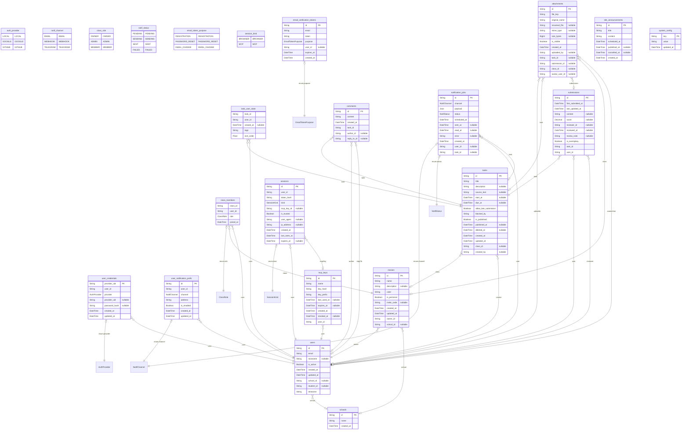

```mermaid
erDiagram

        auth_provider {
            LOCAL LOCAL
GOOGLE GOOGLE
GITHUB GITHUB
        }
    


        notif_channel {
            EMAIL EMAIL
WEBHOOK WEBHOOK
TELEGRAM TELEGRAM
        }
    


        class_role {
            OWNER OWNER
ADMIN ADMIN
MEMBER MEMBER
        }
    


        notif_status {
            PENDING PENDING
SENDING SENDING
SENT SENT
FAILED FAILED
        }
    


        email_token_purpose {
            REGISTRATION REGISTRATION
PASSWORD_RESET PASSWORD_RESET
EMAIL_CHANGE EMAIL_CHANGE
        }
    


        session_kind {
            BROWSER BROWSER
MCP MCP
        }
    
  "schools" {
    String id "PK"
    String name 
    DateTime created_at 
    }
  

  "users" {
    String id "PK"
    String email 
    String nickname "nullable"
    Boolean is_active 
    DateTime created_at 
    DateTime updated_at 
    String school_id "nullable"
    String student_id "nullable"
    String timezone 
    }
  

  "user_credentials" {
    String provider_uid "PK"
    String user_id 
    AuthProvider provider 
    String provider_uid "nullable"
    String password_hash "nullable"
    DateTime created_at 
    DateTime updated_at 
    }
  

  "user_notification_prefs" {
    String id "PK"
    String user_id 
    NotifChannel channel 
    String address 
    Boolean is_enabled 
    DateTime created_at 
    DateTime updated_at 
    }
  

  "classes" {
    String id "PK"
    String name 
    String description "nullable"
    String color 
    Boolean is_personal 
    String invite_code "nullable"
    DateTime created_at 
    DateTime updated_at 
    String owner_id 
    String school_id "nullable"
    }
  

  "class_members" {
    String class_id 
    String user_id 
    ClassRole role 
    DateTime joined_at 
    }
  

  "tasks" {
    String id "PK"
    String title 
    String description "nullable"
    String source_text "nullable"
    DateTime start_at "nullable"
    DateTime due_at "nullable"
    Boolean allow_late_submission 
    String blocked_by 
    Boolean is_published 
    DateTime published_at "nullable"
    DateTime deleted_at "nullable"
    DateTime created_at 
    DateTime updated_at 
    String class_id "nullable"
    String created_by "nullable"
    }
  

  "task_user_state" {
    String task_id 
    String user_id 
    DateTime viewed_at "nullable"
    String tags 
    Float sort_order 
    }
  

  "submissions" {
    String id "PK"
    DateTime first_submitted_at 
    DateTime last_updated_at 
    String content "nullable"
    Decimal score "nullable"
    String reviewer_id "nullable"
    DateTime reviewed_at "nullable"
    String review_note "nullable"
    Boolean is_exemplary 
    String task_id 
    String user_id 
    }
  

  "comments" {
    String id "PK"
    String content 
    DateTime created_at 
    String task_id 
    String author_id "nullable"
    String reply_to_id "nullable"
    }
  

  "attachments" {
    String id "PK"
    String file_key 
    String original_name 
    String renamed_file "nullable"
    String mime_type "nullable"
    BigInt size_bytes "nullable"
    Boolean is_visible 
    DateTime created_at 
    String uploaded_by "nullable"
    String task_id "nullable"
    String submission_id "nullable"
    String class_id "nullable"
    String avatar_user_id "nullable"
    }
  

  "notification_jobs" {
    String id "PK"
    NotifChannel channel 
    Json payload 
    NotifStatus status 
    DateTime scheduled_at 
    DateTime sent_at "nullable"
    DateTime read_at "nullable"
    String error "nullable"
    DateTime created_at 
    String user_id "nullable"
    String task_id "nullable"
    }
  

  "email_verification_tokens" {
    String id "PK"
    String email 
    String token 
    EmailTokenPurpose purpose 
    String user_id "nullable"
    DateTime expires_at 
    DateTime created_at 
    }
  

  "site_announcements" {
    String id "PK"
    String title 
    String content 
    DateTime scheduled_at 
    DateTime published_at "nullable"
    DateTime cancelled_at "nullable"
    DateTime created_at 
    }
  

  "mcp_keys" {
    String id "PK"
    String name 
    String key_hash 
    String key_prefix 
    DateTime last_used_at "nullable"
    DateTime expires_at "nullable"
    DateTime created_at 
    DateTime revoked_at "nullable"
    String user_id 
    }
  

  "sessions" {
    String id "PK"
    String user_id 
    String token_hash 
    SessionKind kind 
    String mcp_key_id "nullable"
    Boolean is_trusted 
    String user_agent "nullable"
    String ip_address "nullable"
    DateTime created_at 
    DateTime last_seen_at 
    DateTime expires_at "nullable"
    }
  

  "system_config" {
    String key "PK"
    String value 
    DateTime updated_at 
    }
  
    "users" }o--|o schools : "school"
    "user_credentials" |o--|| "AuthProvider" : "enum:provider"
    "user_credentials" }o--|| users : "user"
    "user_notification_prefs" |o--|| "NotifChannel" : "enum:channel"
    "user_notification_prefs" }o--|| users : "user"
    "classes" }o--|| users : "owner"
    "classes" }o--|o schools : "school"
    "class_members" |o--|| "ClassRole" : "enum:role"
    "class_members" }o--|| classes : "class"
    "class_members" }o--|| users : "user"
    "tasks" }o--|o classes : "class"
    "tasks" }o--|o users : "creator"
    "task_user_state" }o--|| tasks : "task"
    "task_user_state" }o--|| users : "user"
    "submissions" }o--|| tasks : "task"
    "submissions" }o--|| users : "user"
    "submissions" }o--|o users : "reviewer"
    "comments" }o--|| tasks : "task"
    "comments" }o--|o users : "author"
    "comments" }o--|o users : "replyTo"
    "attachments" }o--|o users : "uploader"
    "attachments" }o--|o tasks : "task"
    "attachments" }o--|o submissions : "submission"
    "attachments" }o--|o classes : "class"
    "attachments" }o--|o users : "avatarUser"
    "notification_jobs" |o--|| "NotifChannel" : "enum:channel"
    "notification_jobs" |o--|| "NotifStatus" : "enum:status"
    "notification_jobs" }o--|o users : "user"
    "notification_jobs" }o--|o tasks : "task"
    "email_verification_tokens" |o--|| "EmailTokenPurpose" : "enum:purpose"
    "mcp_keys" }o--|| users : "user"
    "sessions" |o--|| "SessionKind" : "enum:kind"
    "sessions" }o--|| users : "user"
    "sessions" }o--|o mcp_keys : "mcpKey"
```
